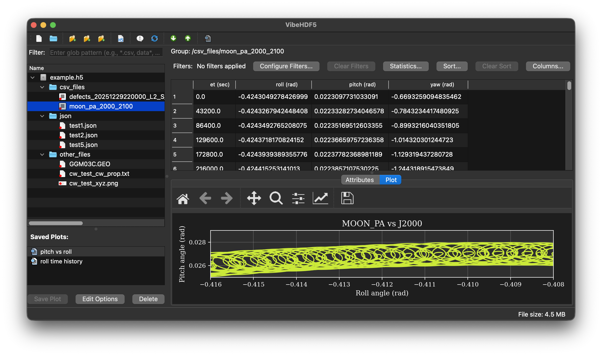

# vibehdf5 - HDF5 File Viewer & Manager



A powerful, lightweight GUI application for browsing, managing, and visualizing HDF5 file structures. Built with PySide6, it provides an intuitive tree-based interface for exploring groups, datasets, and attributes, with advanced features for content management and data preview.

## Features

### 🔍 **Browse & Explore**
- **Hierarchical Tree View**: Navigate HDF5 file structure with expandable groups and datasets
- **Dataset Information**: View shape, dtype, and content previews for all datasets
- **Attribute Display**: Browse attributes attached to groups and datasets
- **Sorting & Search**: Sort tree columns and quickly locate items

### 📊 **Data Preview**
- **Text Preview**: View dataset contents as text with automatic truncation for large data
- **Syntax Highlighting**: Automatic color-coded syntax for Python, JavaScript, C/C++, Fortran, JSON, YAML, XML, HTML, CSS, Markdown, and more
- **Image Display**: Automatic PNG image rendering for datasets with `.png` extension
- **Smart Scaling**: Images scale automatically to fit the preview panel while maintaining aspect ratio
- **Binary Data Handling**: Hex dump preview for non-text binary datasets
- **Variable-Length Strings**: Proper handling of HDF5 variable-length string datasets
- **Extensible Language Support**: Easy to add support for additional programming languages

### 📈 **CSV Data, Filtering & Plotting**
- **CSV Import**: Import CSV files as HDF5 groups with one dataset per column
- **Table Display**: View CSV data in an interactive table with column headers
- **Column Filtering**: Apply multiple filters to CSV tables (==, !=, >, >=, <, <=, contains, startswith, endswith)
- **Filter Persistence**: Filters are automatically saved in the HDF5 file and restored when reopening
- **Saved Plot Configurations**: Save multiple plot configurations per CSV group with customizable styling
- **Interactive Plotting**: Embedded matplotlib plots with full navigation toolbar (zoom, pan, save)
- **Plot Management**: Create, edit, delete, and instantly switch between saved plot configurations
- **Comprehensive Styling**: Customize plot titles, axis labels, grid, legend, and per-series styling
- **Series Customization**: Configure line color, style, marker type, line width, and marker size for each data series
- **Plot Persistence**: All plot configurations stored in HDF5 and restored when reopening files
- **Export Filtered Data**: Drag-and-drop CSV export includes only filtered rows
- **Filter Management**: Configure, clear, and view active filters with real-time table updates
- **Independent Settings**: Each CSV group maintains its own filters and plot configurations

### ✏️ **Content Management**
- **Add Files**: Import individual files into the HDF5 archive via toolbar or drag-and-drop
- **Add Folders**: Import entire directory structures with hierarchy preservation
- **Delete Items**: Remove datasets, groups, or attributes via right-click context menu
- **Drag & Drop Import**: Drag files or folders from your file manager directly into the tree
- **Smart Target Selection**: Automatically determines the correct group for imported content based on selection
- **Overwrite Protection**: Confirmation prompts when importing would overwrite existing data
- **Exclusion Filters**: Automatically skips system files (.DS_Store, .git, etc.)

### 📤 **Export & Extract**
- **Drag Out**: Drag datasets or groups from the tree to export to your filesystem
- **Dataset Export**: Datasets saved as individual files
- **Group Export**: Groups exported as folders with complete hierarchy
- **Format Preservation**: Text datasets saved as UTF-8, binary data preserved exactly

### 🎨 **User Interface**
- **Split Panel Layout**: Adjustable splitter between tree view and preview panel
- **Toolbar Actions**: Quick access to common operations
- **Keyboard Shortcuts**:
  - `Ctrl+N`: Create new HDF5 file
  - `Ctrl+O`: Open HDF5 file
  - `Ctrl+Shift+F`: Add files
  - `Ctrl+Shift+D`: Add folder
  - `Ctrl+Q`: Quit
- **Status Bar**: Real-time feedback on operations
- **Alternating Row Colors**: Enhanced readability

## Installation

### Using pip

```bash
pip install vibehdf5
```

### From Source

```bash
git clone https://github.com/jacobwilliams/vibehdf5.git
cd vibehdf5
pip install -e .
```

### Using pixi (for development)

```bash
cd vibehdf5/env
pixi shell
```

## Usage

### Launch the Application

After installation, launch from the command line:

```bash
vibehdf5
```

Or open a specific file:

```bash
vibehdf5 /path/to/your/file.h5
```

### From Python

```python
from vibehdf5 import main
main()
```

### Development Mode

Run directly from source:

```bash
python -m vibehdf5.hdf5_viewer [file.h5]
```

## Working with Files

### Creating New Files
1. Click **New HDF5 File…** in the toolbar or press `Ctrl+N`
2. Choose a location and filename (`.h5` extension added automatically if not provided)
3. If the file already exists, you'll be prompted to confirm overwrite
4. The new empty HDF5 file is created and loaded in the viewer
5. You can immediately start adding content via the methods below

### Opening Files
1. Click **Open HDF5…** in the toolbar or press `Ctrl+O`
2. Select an HDF5 file (.h5 or .hdf5)
3. The tree will populate with the file structure

### Adding Content

**Add Individual Files:**
1. Click **Add Files…** in the toolbar or press `Ctrl+Shift+F`
2. Select one or more files
3. Files are added to the currently selected group (or root if none selected)

**Add Folders:**
1. Click **Add Folder…** or press `Ctrl+Shift+D`
2. Select a directory
3. The entire folder structure is recursively imported

**Drag & Drop:**
- Drag files or folders from your file manager
- Drop onto any group, dataset, or attribute in the tree
- Content is automatically added to the appropriate location

### Deleting Content
1. Right-click on a dataset, group, or attribute
2. Select the delete option from the context menu
3. Confirm the deletion

**Warning:** Deletions are permanent and modify the HDF5 file immediately.

### Exporting Content
- Drag any dataset or group from the tree to your file manager
- Datasets are extracted as individual files
- Groups are extracted as folders with full hierarchy

### Viewing Data
- Click any dataset to see a preview in the right panel
- PNG images are automatically rendered
- Text data displays with syntax highlighting
- Binary data shows as hex dump

### Working with CSV Data

**Importing CSV Files:**
1. Use **Add Files…** or drag-and-drop to import a CSV file
2. CSV files are automatically converted to HDF5 groups with:
   - One dataset per column preserving data types
   - Column names stored as group attributes
   - Source file metadata for reference

**Viewing CSV Tables:**
1. Click on a CSV group in the tree (marked with `source_type='csv'` attribute)
2. Data displays as an interactive table with column headers
3. Select multiple columns (Ctrl/Cmd+Click) for analysis

**Filtering CSV Data:**
1. Click **Configure Filters…** above the table
2. Add filter conditions:
   - Select column name
   - Choose operator (==, !=, >, >=, <, <=, contains, startswith, endswith)
   - Enter value to compare against
3. Add multiple filters (combined with AND logic)
4. Filters are **automatically saved** to the HDF5 file
5. Click **Clear Filters** to remove all filters

**Filter Features:**
- Filters persist when closing and reopening files
- Each CSV group has independent filters
- Numeric comparisons (>, >=, <, <=) automatically convert values
- String operations (contains, startswith, endswith) for text data
- Real-time table updates when filters change
- Status shows "X filter(s) applied" and filtered row count

**Plotting Filtered Data:**
1. Select 2 or more columns in the table (Ctrl/Cmd+Click)
2. Click **Save Plot** to create a new plot configuration
3. Enter a name for the plot (e.g., "Temperature vs Time")
4. The plot appears in the **Saved Plots** list below the tree view
5. Select any saved plot to instantly display it in the Plot tab
6. Only filtered/visible rows are plotted
7. Plot title shows filter status (e.g., "150/1000 rows, filtered")

**Managing Saved Plots:**
1. **Saved Plots List**: All plot configurations appear below the tree view
2. **Auto-Apply**: Click any plot in the list to instantly display it
3. **Edit Options**: Click **Edit Options** to customize plot styling
4. **Delete**: Click **Delete** or right-click to remove a plot configuration
5. **Persistence**: All plots are saved in the HDF5 file and restored on reopening

**Customizing Plot Appearance:**
1. Select a saved plot and click **Edit Options**
2. **General Tab**:
   - Change plot name
   - Set custom plot title (or leave blank for auto-generated)
   - Set X-axis and Y-axis labels (or leave blank for column names)
   - Toggle grid and legend on/off
3. **Series Styles Tab**:
   - Configure each data series independently
   - Choose from 10 colors: blue, red, green, orange, purple, brown, pink, gray, olive, cyan
   - Select line style: Solid, Dashed, Dash-dot, Dotted, or None
   - Choose marker: Circle, Square, Triangle, Diamond, Star, Plus, X, Point, or None
   - Adjust line width (0.5 to 5.0)
   - Set marker size (1.0 to 20.0)
4. Click **OK** to apply changes - the plot updates immediately

**Plot Features:**
- **Interactive Navigation**: Full matplotlib toolbar with zoom, pan, reset, and save-to-file
- **Multi-Series Support**: Plot multiple Y columns against a single X column
- **Data Range Selection**: Plots use the current filtered data and row range
- **Embedded Display**: Plots appear in a dedicated tab in the main window
- **Quick Switching**: Instantly switch between different plot configurations
- **Format Preservation**: All styling settings persist with the HDF5 file

**Exporting Filtered Data:**
1. Drag CSV group from tree to your file manager
2. Exported CSV file contains **only filtered rows**
3. If no filters are active, all rows are exported
4. Original column names and order are preserved

## Project Structure

```
vibehdf5/
├── vibehdf5/
│   ├── __init__.py           # Package initialization with version
│   ├── hdf5_viewer.py        # Main GUI application and window
│   ├── hdf5_tree_model.py    # Qt model for HDF5 tree structure
│   └── utilities.py          # Helper functions for archiving and inspection
├── pyproject.toml            # Package metadata and dependencies
├── README.md                 # This file
├── LICENSE                   # License information
└── env/
    └── pixi.toml             # Pixi environment configuration
```

## Architecture

### Components

**HDF5Viewer** (`hdf5_viewer.py`)
- Main window with QTreeView and split panel layout
- Handles user interactions, toolbar actions, and preview rendering
- Implements drag-and-drop for both import and export
- Context menu for deletion operations

**HDF5TreeModel** (`hdf5_tree_model.py`)
- Qt QStandardItemModel that represents HDF5 structure
- Recursively loads groups, datasets, and attributes
- Provides drag data for export operations
- Stores metadata in custom Qt roles (path, kind, attribute keys)

**DropTreeView** (`hdf5_viewer.py`)
- Custom QTreeView subclass
- Accepts external file/folder drops from the OS
- Determines target group based on drop location
- Forwards drops to the viewer's batch import handler

**Utilities** (`utilities.py`)
- `archive_to_hdf5()`: Archive directory structures into HDF5
- `print_file_structure_in_hdf5()`: Print HDF5 contents to console
- Exclusion lists for system files and directories

### Data Storage

**Text Files:**
- Stored as UTF-8 encoded string datasets using `h5py.string_dtype(encoding='utf-8')`

**Binary Files:**
- Stored as 1D uint8 arrays using `np.frombuffer(data, dtype='uint8')`
- Ensures proper preservation of binary content (PNG images, etc.)

**Directory Structure:**
- Folders map to HDF5 groups
- File hierarchy is preserved in group paths
- Excluded items (.git, .DS_Store, etc.) are automatically skipped

## Dependencies

- **Python** ≥ 3.8
- **PySide6** or **PyQt6** (via qtpy abstraction)
- **h5py** - HDF5 interface
- **numpy** - Array operations
- **pandas** - CSV import and data filtering
- **matplotlib** - Plotting (optional, for CSV plotting features)
- **qtpy** - Qt abstraction layer for PySide6/PyQt6 compatibility

## Tips & Best Practices

### Performance
- The viewer loads the entire tree structure on open
- For very large files (thousands of items), initial load may take a few seconds
- Preview panel limits displayed content to 1 MB by default
- CSV tables with many columns may take time to populate initially
- Filters are applied in-memory for fast updates

### File Organization
- Use descriptive group names to organize related datasets
- Store metadata as attributes rather than separate datasets when appropriate
- For binary files like images, use extensions in dataset names (.png, .jpg) to enable preview features
- Import related CSV files to keep tabular data organized

### CSV Data Management
- Filters are stored as JSON in the `csv_filters` attribute of CSV groups
- Plot configurations are stored as JSON in the `saved_plots` attribute of CSV groups
- Each CSV group maintains independent filter state and plot configurations
- Large CSV files (10,000+ rows) display efficiently with filtered views
- Use filters before plotting or exporting to work with specific data subsets
- Column data types are preserved during import (numeric, string, etc.)
- Create multiple plot views of the same data with different styling and filters

### Workflow Integration
- Use drag-and-drop to quickly archive project files
- Export specific datasets for analysis in other tools
- Delete temporary or obsolete data to keep archives clean
- Apply filters to CSV data before exporting for downstream analysis
- Create multiple filtered views of the same data by duplicating CSV groups
- Save plot configurations to quickly regenerate visualizations
- Use plot styling to create publication-ready figures directly from HDF5 data
- Share HDF5 files with embedded plots and filters for reproducible analysis

## Troubleshooting

**Application won't start:**
- Ensure PySide6 is installed: `pip install PySide6`
- On Apple Silicon Macs, use the pixi environment or install the native ARM64 build

**Drag-and-drop not working:**
- Ensure you're dropping onto the tree view itself
- Check that the HDF5 file is opened in read-write mode (it should be by default)
- Verify file permissions allow modification

**Image preview not working:**
- Check that the dataset name ends with `.png`
- Verify the dataset contains valid PNG binary data (stored as uint8 array)
- Use the utilities module to re-import images with proper encoding

**Import errors about Qt modules:**
- These are often harmless linter/type-checker warnings
- The application uses qtpy for compatibility, which will use whatever Qt binding is available
- At runtime, the code should work fine as long as PySide6 or PyQt6 is installed

## Development

### Launching from the pixi environment

```bash
pixi shell --manifest-path ./env/pixi.toml
python -m vibehdf5
```

### Running Tests
```bash
# From the project root
pytest
```

### Code Style
```bash
# Format with ruff
ruff format vibehdf5/

# Lint
ruff check vibehdf5/
```

### Building Package
```bash
python -m build
```

## Acknowledgments

Built with:
- [h5py](https://www.h5py.org/) - Pythonic interface to HDF5
- [PySide6](https://wiki.qt.io/Qt_for_Python) - Python bindings for Qt
- [NumPy](https://numpy.org/) - Numerical computing library
- [Pandas](https://pandas.pydata.org) - Data analysis and manipulation tool

## Similar projects

* [HDFView](https://www.hdfgroup.org/download-hdfview/) -- the official HDF5 viewer (Java)
* [hdf5view](https://github.com/tgwoodcock/hdf5view/)
* [hdf5-viewer](https://github.com/loenard97/hdf5-viewer)
* [argos](https://github.com/titusjan/argos)
