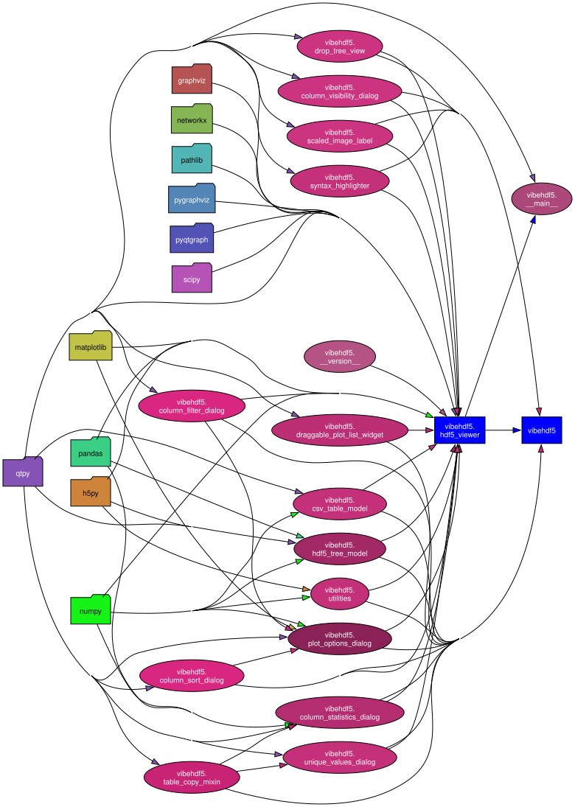

### Code dependency diagram

In a conda environment with `python`, `graphviz`, and `pydeps`, run:

```
pydeps vibehdf5 -T svg --include-missing --rankdir=LR --exclude=test --cluster
```

To get:



Note, you may have to run `doc -c` to initialize graphviz.

